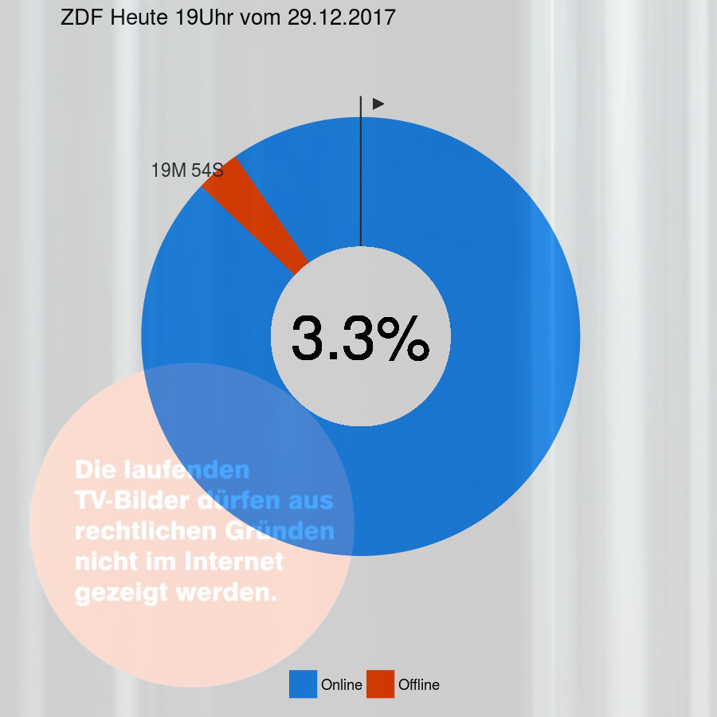

# heuteZensiert

Seit der Einführung des neuen Rundfunkbeitrags am 1.1.2013, ehemals GEZ, zahlen deutsche Haushalte einen geräteunabhängigen Beitrag. TV und Internet wurden hier gleichgestellt. Dieses Projekt beschäftigt sich mit Nachrichtensendungen von ARD unf ZDF im Speziellen.

> Die Angebote von ARD, ZDF und Deutschlandradio lassen sich heute auf verschiedenen Wegen empfangen – ob über Radio, Fernseher, Computer oder Smartphone.  
> -- [Faktenblatt von www.rundfunkbeitrag.de](https://www.rundfunkbeitrag.de/e175/e224/Faktenblatt_zum_neuen_Rundfunkbeitrag.pdf) vom 29.11.2012

Viele Personen/Haushalte verzichten aus diesem Grund auf ein Fernsehgerät und empfangen die Öffentlich-Rechtlichen wie Streaming-Dienste. Dort stehen jedoch nicht immer die gleichen Inhalte zur Verfügung wie im konventionellen Fernsehen. Online werden Passagen aus der Berichterstattung ausgeschnitten, bzw. mit einem Standbild überlagert.

> "Kurze Unterbrechung - Die laufenden TV- Bilder dürfen aus rechtlichen Gründen nicht im Internet gezeigt werden"

Die betroffenen Themenbereiche sind zumeist der Sportteil, aber auch andere Abschnitte können betroffen sein. Welche Inhalte online verfügbar sind und welche nicht, ist für den Endnutzer nicht nachvollziehbar. Es ist anzunehmen, dass es die von Dritten angekaufen Videosequenzen sind. Doch eigentlich müssten die Sender, wenn sie den neuen Rundfunkbeitrag verwenden, sich bei Verträge mit Dritten für alle Beitragszahler gleichmäßig einsetzen. Ausstrahlungsrechte, welche lediglich die TV-Ausstrahulng zulassen, dürften nicht abgeschlossen werden.

# heuteStatistik
Um den genauen Anteil der nicht ausgestrahlen Nachrichtensendungen zu erfassen, werden *heute 19Uhr*, *heute Journal* und *Tagesschau* von einem RaspberryPi angeschaut. Ein kleines *R* Programm erkennt mithilfe von [Texterkennungssoftware](https://github.com/ropensci/tesseract) die zensierten Frames. Anschließend veröffentlicht dieser [Twitter-Bot](https://twitter.com/heuteNichtDrin) das Ergebnis.

TV und Online - wir zahlen das Gleiche, wir wollen das Gleiche sehen.

  

Der etwas reißerische Begriff Zensur wurde mit Absicht gewählt.   
1) Dem digitalen Nachrichtenschauer werden bewusst Inhalte vorenthalten. Da die Nachrichten online zeitgleich (oder gar später) ausgestrahlt werden, hat Letzterer keine Möglichkeit mehr, die zensierten Passagen im TV nachzuschauen.  
2) Die Online-Version der Nachrichtensendung wird offensichtlich nachbearbeitet. Digital Natives sind besonders betroffen und im Vergleich zu analogen Nutzern schlechter informiert.  
3) Da einzelne eMails an `Zuschauerredaktion@zdf.de` leider keine sichtbaren Folgen nach sich ziehen, möchten die Initiatoren eine große Masse mobilisieren, um den Druck auf das ZDF zu erhöhen. Gleiche Leistung für gleichen Rundfunkbeitrag!  
4) Ziel ist es datengetragene Krtik am ZDF zu üben, der resuliterende Datensatz ist frei verfügbar.

# heuteMitmachen
Das Open-Source Projekt läd zum mitmachen ein. Neben den Tweets wird auch eine [Tabelle](Logfile.csv) fortgeschrieben. Ein wissenschaftliches Projekt könnte diese auf ihre Muster hin analysieren. 

Auch von der Software Seite her gibt es noch Potentziale. Bspw. ließe sich das OCR auch auf weitere Bildauschnitte hin fokusieren (Name und Organisation der Interviewten). Wie man die R-Skripte installiert, erfährst du [hier](./Install.md).
